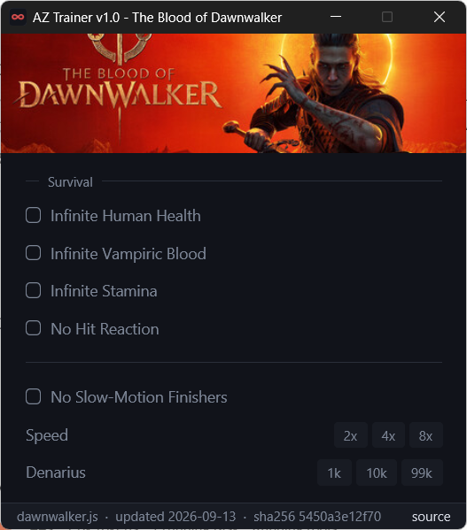
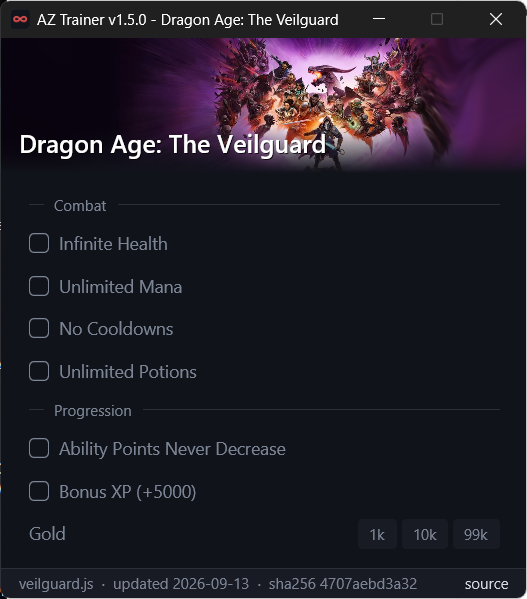
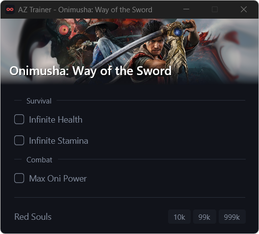
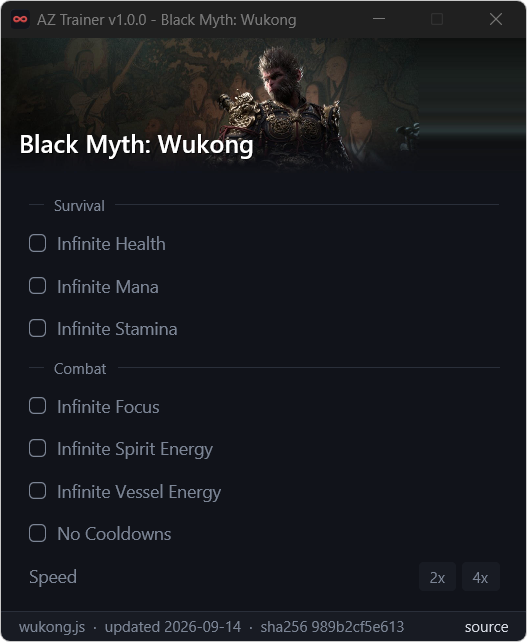
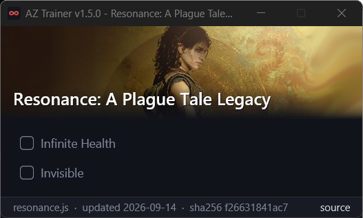
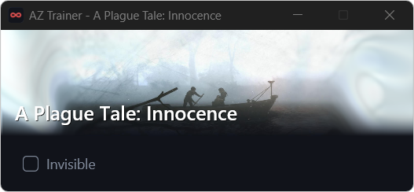
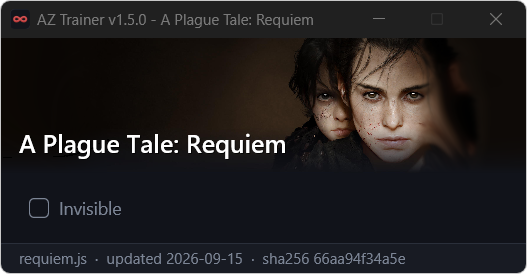

# AZ Trainer

A small, fast game trainer for Windows. Start it, start your game, click what you want.

| The Blood of Dawnwalker | Dragon Age: The Veilguard |
| :---: | :---: |
|  |  |

| Onimusha: Way of the Sword | Black Myth: Wukong |
| :---: | :---: |
|  |  |

| Resonance: A Plague Tale Legacy | A Plague Tale: Innocence |
| :---: | :---: |
|  |  |

| A Plague Tale: Requiem | |
| :---: | :---: |
|  | |

## Features

- Detects the running game automatically, and its version: a script never touches a build it was not made for
- Remembers your settings per game
- Keyboard shortcuts (e.g. Alt+F1-F3 for speed), with a brief on-screen notice in game
- Updates itself, including new games and fixes
- Shows which script is loaded: its update date, checksum and a link to its source

Single-player only. Do not use with online or competitive games.

## Usage

1. Download `az_trainer.exe` from the [latest release](../../releases/latest) and put it in a folder of its own.
2. Run it and start the game. On first start it downloads the game scripts next to itself.
3. Click the options you want.
4. Close the trainer with **X** when done.

If it says "cannot open process", run it as Administrator.

## Adding games

Each game is a single JavaScript file. See [docs/DEVELOPING.md](docs/DEVELOPING.md).
